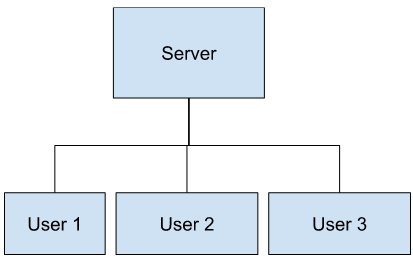
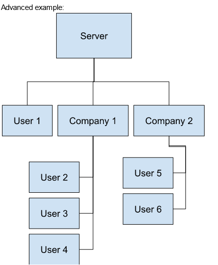

Rate Limiter Project
created by Charity Grey (c) 2023
[GitHub Repo link](https://github.com/charity-g/Rate-Limiter-2023-Project)

# Table of Contents
1. [Running the Project(deployment)](#deployment)
2. [Project Context](#project-context)
3. [Project Implementation](#project-implementation)
4. [Credits](#credits)

## Deployment
Feel free to use any compiler to run main. My tutorial uses g++.

TUTORIAL:
In the terminal, cd into the folder and type `g++ -o rateproj main.cpp`. Afterwards, please run the program by typing `./rateproj`.

## Project context:
[Back to top](#table-of-contents)

Database Server is responding to querying requests from different users + computers, and we must manage different requests and queue them equally without letting one user clog up the server with all their requests

REQUIREMENTS:
- Each “company” may have different users (computers) all requesting queries 
- Queries may finish at different times
- Two CPUs(for now) that can process one query request each at a time
- Manage different requests and queue them equally based on time frame, incoming 
- The database manager is ACID compliant, so we do not have to worry about consistency. In event that the server takes in a query that fails, it will seperately contact the client.

User Requirements:
- To see the 3 different options of rate limiting algorithm on a variety of pre-set use cases
Pre-set use cases:
- No calls
- Perfect case
- Many users, spread out
- Many users at once
- Constant use and then spike in users
- Random case

For example:
Here the 3 users are making multiple requests to the server, some more than the other. To prevent overwhelming our server, we must devise a way to fairly distribute and queue the requests. Lets say Users 1 and 2 make requests at reasonable intervals, however out of nowhere, User 3 makes way more requests than the server can handle. We should cut off some of User 3's requests and prevent the server from responding to just user 3's requests so we don't block off service to user 1 and 2.

Advanced version: for future implementation. TODO 22Oct23;

## Project Implementation:
Using the terminal:

To test which implementation is better at maxing out user request acceptance but prevent DoS attack, we have a few possible testing environment implementations:
Terminal requests
GUI 
API sending actual https requests

The vision of Project Implementation is to create an environment where the user can simulate the sending of requests, and then see how the solutions for rate limiting respond to it.

REQUIREMENTS:
- Users must be identified. We will start with the terminal being one user
- Timestamps must be identified. We will start without pre-scheduling times, and simply focus on using computer time.
- Number of requests. For now, unlimited requests at one time.
- Design of rate limiter. We will start without an rate limiter, just an abstract virtual server that can handle all requests in 1 second.

OUTPUT:
A log of the requests given.

# Credits
[Back to top](#table-of-contents)

- https://towardsdatascience.com/designing-a-rate-limiter-6351bd8762c6
- https://www.youtube.com/watch?v=FU4WlwfS3G0
- https://blog.logrocket.com/rate-limiting-node-js/ 
- https://symfony.com/doc/current/rate_limiter.html